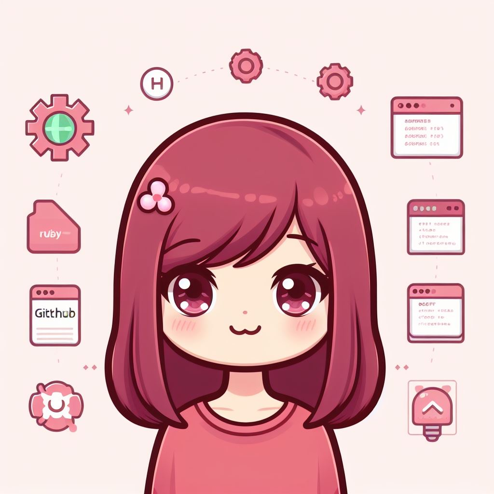

{: width="250" .float-left .mr-3 }
Wypchnięcie kodu na GitHub
{: .fs-8 .ls-10 .code-example .fw-700}


Na pewno bardzo irytujący jest scenariusz, kiedy ma się jako tako działający kod, ale coś pozmienia, niewiadomo co i nic już nie działa... Dzięki gitowi nic straconego, można wrócić do starej wersji, a przy okazji podzielić się też swoim kodem z innymi.

[GitHub](https://github.com) jest jednym z najpopularniejszych miejsc przechowywania repozytoriów kodu. Oto użyć go do własnego projektu (np. Greetera z poprzedniego zadania):
-  wejdź  [tutaj](https://github.com/new), aby stworzyć nowe repo o nazwie  `exercises`  [https://github.com/new](https://github.com/new)
-  proszę NIE zaznaczaj opcji, żeby stworzyć plik readme (nie jest potrzebny)
-  repo zrób publiczne, żebym mogła je widzieć
-  otwórz terminal i wpisz
```
git clone git@github.com:rosesz/exercises.git
```

Na dysku pojawi się nowy katalog  `exercises`  i to w nim stworzysz plik  `greeter.rb`. Kod będzie wtedy uruchamiany tak (jeśli jesteś w domyślnym katalogu w terminalu):  
```
ruby exercises/greeter.rb
```
można też wejść do tego folderu:  
```
cd exercises
```
I wtedy nie trzeba już za każdym razem podawać ścieżki 🙂
Teraz możesz stworzyć pierwszą wersję pliku  `greeter.rb`  
Każde zmiany w kodzie przed zapisaniem w gicie trzeba najpierw dodać. Możesz to zrobić na dwa sposoby:  
```
git add greeter.rb
```
To doda tylko ten jeden plik  
```
git add .
```
To doda wszystkie pliki w projekcie. Na tym etapie jest tylko jeden, więc to nie ma znaczenia 🙂
Po tym kroku musisz jeszcze zapisać swoje zmiany i jakoś je opisać:  
```
git commit -m "Created greeter.rb"
```
Na koniec zmiany trzeba wypchnąć na githuba  
```
git push origin main
```
I voilà! Teraz będę widzieć kod, który stworzyłaś, a ty będziesz miała do niego zawsze dostęp, nawet jak np. Twój komputer się zepsuje. Przy kolejnych zmianach powtarzasz kroki, tj. dodajesz zmienione pliki, opisujesz zmiany, wypychasz 💪

{: .new-title }
> Ciekawostka
>
> GitHub odgrywa kluczową rolę dla programistów, będąc istotnym narzędziem do przechowywania, udostępniania i współpracy nad kodem źródłowym projektów. I to właśnie framework Ruby on Rails został wykorzystany do jego stworzenia.
