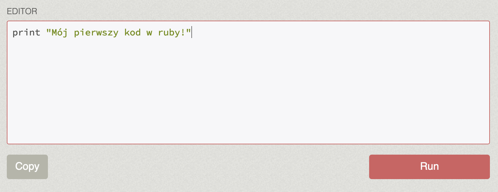

{: width="250" .float-left .mr-3 }
Zacznij tutaj! Pierwsze kroki
{: .fs-8 .ls-10 .code-example .fw-700}

Pora zobaczyć, z czym je się to całe programowanie. Języków, w których można pisać kod, jest wiele, ale proponuję ten o wdzięcznej nazwie **Ruby**. Aby zacząć, nie potrzeba specjalistycznych studiów, przeglądania masy teorii w książkach, a nawet specjalnego przygotowywania swojego komputera (choć na dalszej drodze będzie to konieczne). Dzięki internetowi można po prostu zacząć i uczyć się na bieżąco.

Świetną stroną, gdzie można spróbować samemu coś napisać i uruchomić, jest **[TryRuby](https://try.ruby-lang.org/)**. Wystarczy wpisać swój kod w okienku _Editor_, kliknąć _Run_, i gotowe.

Niżej możemy podziwiać efekty działania programu. TryRuby oferuje tutorial z podstawowych możliwości Ruby, z którym zdecydowanie warto się zapoznać.

{: .note-title }
> Wskazówka
>
> Nic nie stoi na przeszkodzie, żeby zamiast klikając _Next_, podążać za kolejnymi instrukcjami, zatrzymać się na chwilę. W edytorze można wpisać własne pomysły na kod, czy to jakieś matematyczne działania, czy prośby o wypisanie kilku linijek wiersza 😊 Zachęcam do eksperymentów i nie przejmowania się, jeśli czasem kod okaże się niepoprawny, bo próbować można do skutku.

Inną stroną, która ciągle pozwala pisać kod w Ruby bez potrzeby konfigurowania niczego na własnym komputerze, a jednocześnie dającą nieco więcej możliwości niż TryRuby, jest **[Replit](https://replit.com/languages/ruby)**. Wystarczy założyć darmowe konto, kliknąć _Create Repl_, wybrać Ruby, i można działać. Nie ma tutaj natomiast żadnego tutoriala, który prowadziłby nas krok po kroku. Dlatego kod to już musi być własna inwencja lub kierowanie się osobnym kursem.

Podsumowując, TryRuby to dobry opis podstawowych elementów języka Ruby i daje możliwość od razu ich przećwiczenia. Niezależnie od tego, czy na tej stronie czy innej, ucząc się nowej składni, warto od razu być kreatywnym i próbować napisać coś według własnego pomysłu. Na początku może to wydawać się trudne, ale z czasem wszystko nabierze sensu.

Powodzenia i udanej zabawy z kodem!

[TryRuby](https://try.ruby-lang.org/){: .btn .btn-purple }
[Replit](https://replit.com/languages/ruby){: .btn }